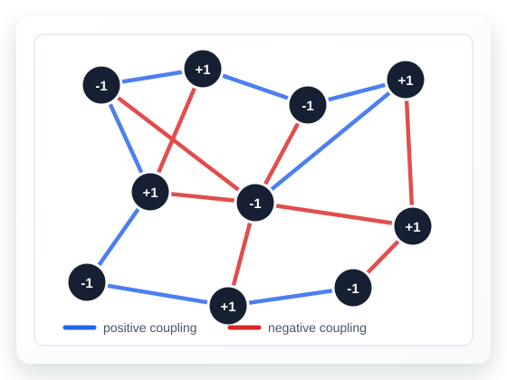

:::: {.hero}
::: {.hero-copy}
# Spin-Glass and XORSAT Benchmarks

This site currently documents the Sherrington--Kirkpatrick (SK) benchmark family and reports the available SK solver results. Edwards--Anderson models, sparse random graph spin glasses, and XORSAT problems are planned for future additions.

[Problem definition](problem_definition.qmd){.btn .btn-primary .btn-lg}
[Results](results.qmd){.btn .btn-outline-primary .btn-lg}
:::

::: {.hero-visual}

:::
::::
